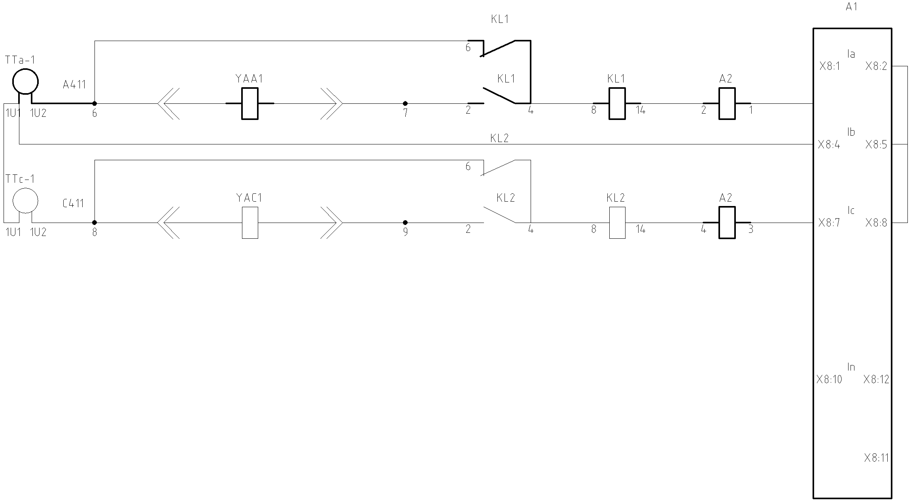
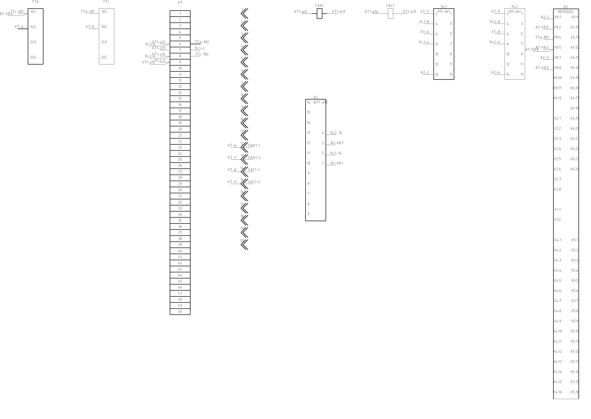

Пример использования модуля
===========================

.. code-block:: python

    from electroproject import *
    import ezdxf

    ct_a = CT2('TTa', highlight=True)
    ct_c = CT2('TTc')
    xt = XT('XT', 50, highlight=True)
    xt1 = Connectors('XT1', 20, highlight=True)
    yat_a = YA('YAA1', highlight=True)
    yat_c = YA('YAC1')
    xt1.n[13].rotate(180)
    xt1.n[15].rotate(180)
    kl1 = RP361('KL1', highlight=True)
    kl2 = RP361('KL2')
    a2 = BPT615('A2', highlight=True)
    a1 = MR5PO50('A1',highlight=True)
    sf = SF('SF1', highlight=True)

    w = []
    w.append(Wire(a2, 1, a1, 'X8:1'))
    w.append(Wire(a2, 3, a1, 'X8:7'))
    w.append(Wire(a1, 'X8:2', a1, 'X8:5'))
    w.append(Wire(a1, 'X8:5', a1, 'X8:8'))
    w.append(Wire(kl1, 14, a2, 2))
    w.append(Wire(kl1, 4, kl1, 8))
    w.append(Wire(xt, -7, kl1, 2))
    w.append(Wire(xt1, 's13', xt, 7))
    w.append(Wire(yat_a, 2, xt1, 'p13'))
    w.append(Wire(xt1, 'p12', yat_a, 1))
    w.append(Wire(xt, 6, xt1, 's12', ''))
    w.append(Wire(ct_a, '1И2', xt, -6, 'A411', highlight=True))
    w.append(Wire(kl2, 14, a2, 4))
    w.append(Wire(kl2, 4, kl2, 8))
    w.append(Wire(xt, 9, kl2, 2))
    w.append(Wire(xt1, 's15', xt, 9))
    w.append(Wire(yat_c, 2, xt1, 'p15'))
    w.append(Wire(xt1, 'p14', yat_c, 1))
    w.append(Wire(xt, 8, xt1, 's14', ''))
    w.append(Wire(ct_c, '1И2', xt, -8, 'C411'))
    w.append(Wire(ct_a, '1И1', ct_c, '1И1'))
    w.append(Wire(xt, 6, kl1, 6))
    w.append(Wire(xt, 8, kl2, 6))
    w.append(Wire(ct_a, '1И1', a1, 'X8:4'))

    doc1 = ezdxf.new()
    doc1.units = ezdxf.units.MM
    msp1 = doc1.modelspace()
    CircuitDiagram(w, msp1)
    doc1.saveas("Принципиальная схема.dxf", encoding='utf-8')

    doc2 = ezdxf.new()
    doc2.units = ezdxf.units.MM
    msp2 = doc2.modelspace()
    WiringDiagram([ct_a,ct_c,xt, xt1,yat_a,yat_c, kl1, kl2,a2, a1],w, msp2)
    doc2.saveas("Монтажная схема.dxf", encoding='utf-8')

    print('Чертёжи сформированы.')

В результате получаем

        Принципиальная схема

        Монтажная схема